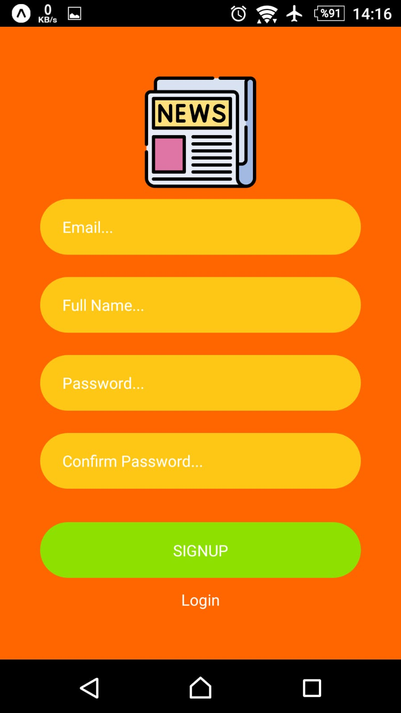
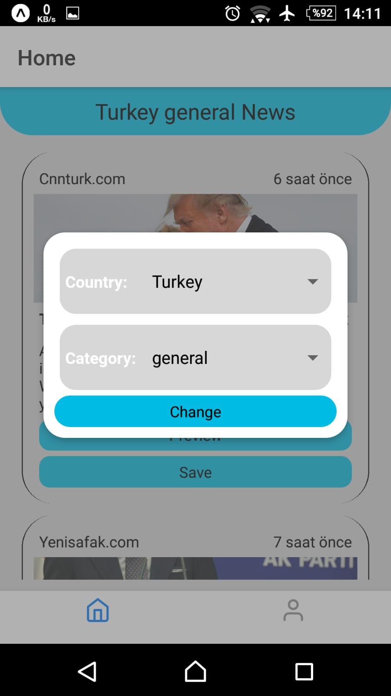
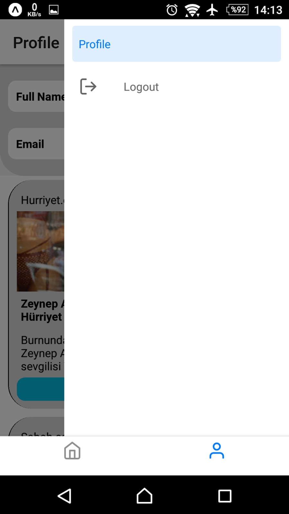
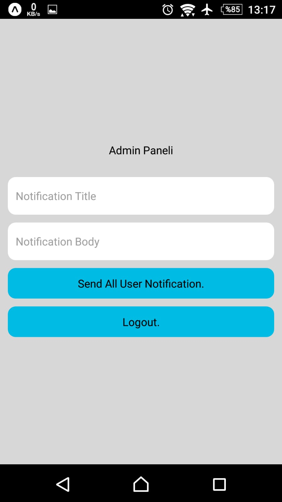

# News App

Mobil uygulama dersi için yaptığım react native projesidir. Uygulamada haberler NewsApi adlı apiden sağlanmaktadır. Firebase Authentication ve Realtime Database kullanılmaktadır.

## Uygulama Ekran Resimleri

